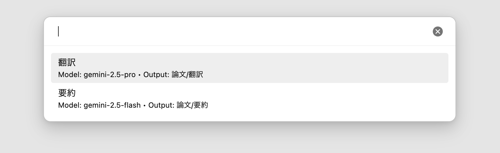
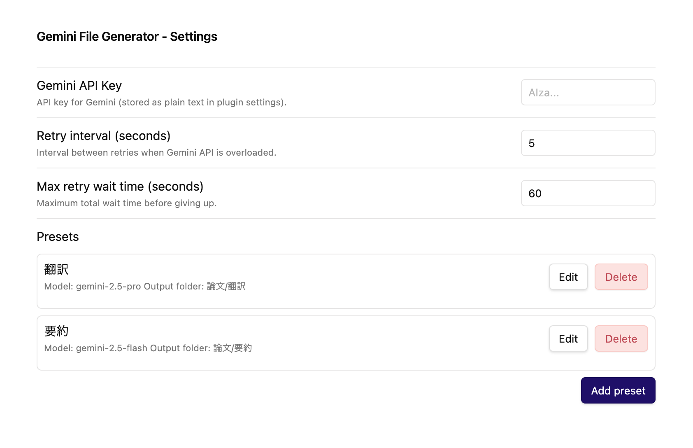
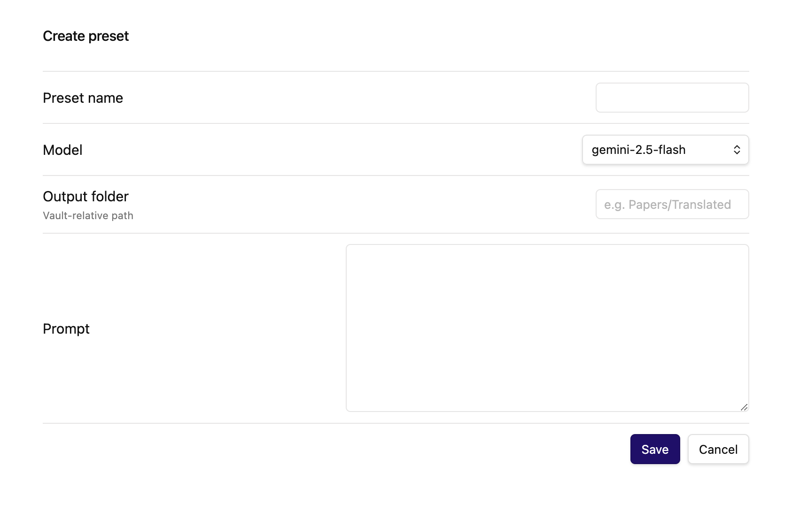

# Obsidian Gemini File Generator

PDFや画像ファイルなどを選択し、Google Gemini API を介してその内容に基づいたMarkdownノートを生成するObsidianプラグインです。

## 特徴

* **ファイルからノート生成**: PDF、テキスト、画像ファイルを選択し、その内容をGeminiに送信して新しいノートを作成します。
* **プリセット管理**: 用途に合わせてモデル、プロンプト、出力先フォルダを「プリセット」として保存・選択できます（例: 「要約用」「翻訳用」など）。

## 使い方

1.  **コマンドを実行**: コマンドパレット（`Ctrl/Cmd + P`）を開き、`Gemini File Generator: Create note from file` を実行します。
2.  **プリセットを選択**: 事前に設定したプリセットのリストが表示されるので、使用したいものを選択します。

    

3.  **ファイルを選択**: システムのファイル選択ダイアログが開くので、処理したいファイル（PDFなど）を選択します。
4.  **生成**: Geminiによる処理が完了すると、指定したフォルダに新しいノートが生成されます。

## 設定



### Gemini API Key
Google AI Studio から取得したAPIキーを入力してください。

### Retry Settings
APIが混雑している場合などの再試行動作を設定できます。
* **Retry interval**: 再試行する間隔（秒）。
* **Max retry wait time**: 最大待機時間（秒）。この時間を超えると処理を中止します。

### Presets
「Add preset」ボタンから新しいプリセットを作成できます。



* **Preset name**: プリセットの表示名。
* **Model**: 使用するGeminiモデル（例: `gemini-2.5-flash`, `gemini-2.5-pro` など）。
* **Output folder**: 生成されたノートを保存するフォルダパス（Vaultルートからの相対パス）。空欄の場合はルートに保存されます。
* **Prompt**: Geminiに送信するプロンプト。ファイルのコンテンツは自動的に添付されるため、ここでは「以下のファイルを要約してください」といった指示を記述します。

## インストール

このリポジトリにはビルド済みのファイルが含まれています。

1. リポジトリから `main.js`, `manifest.json`, `styles.css` をダウンロードします。
2. Obsidianのプラグインフォルダ（`.obsidian/plugins/obsidian-gemini-file-generator/`）を作成し、ファイルを配置します。
3. Obsidianの設定 > Community Plugins でプラグインを有効化します。

## 開発

ソースコード（`src/`）を修正してビルドする場合の手順です。

### 必要要件
* Node.js

### ビルド手順

```bash
npm install
npm run build
```


